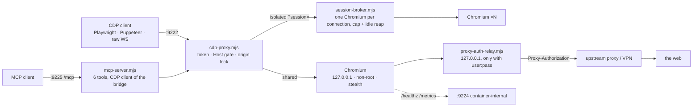

# browser-bridge architecture

Back to the [README](../README.md).

## Architecture

- **Launcher** ([`launch.mjs`](../launch.mjs)) starts Chromium through puppeteer-extra with the full stealth evasion set and a realistic argument set: 1920×1080 window, `en-US,en`, WebGL and accelerated canvas on, font hinting set, `--enable-automation` gone. The user-agent pool is derived at startup from `chromium --version` ([`ua.mjs`](../ua.mjs)) so a UA can never claim a version the engine is not.
- **Proxy** ([`cdp-proxy.mjs`](../cdp-proxy.mjs)) fronts Chromium's loopback debugger on `0.0.0.0:9222`. It is a byte pipe with three checks at the door: token, `Host`, and the WebSocket URL. Chromium rejects DNS names in `Host`, which is why remote CDP usually means digging up a container IP; the proxy presents loopback upstream so `connectOverCDP('http://browser:9222')` works by service name once auth is on.
- **Broker** ([`session-broker.mjs`](../session-broker.mjs)) is opt-in. In `isolated` mode each connection gets its own Chromium process, with a concurrency cap and an idle reaper; named sessions survive reconnects.
- **Reaper** closes idle blank tabs, pages idle past a TTL, and pages beyond a hard count, measured from last navigation so an actively reused page is never touched.
- **Health** ([`/healthz`](configuration.md#health-and-metrics)) returns `503` only when the CDP connection is gone. A wedged-but-connected browser reports `"pageCheck":"degraded"`; a proxy in fallback reports `"egress":"direct"`, still `200`, so an autoheal never turns a degraded egress into a restart loop.
